# Zmax Request Primer Analizi

## Sistem Mimarisi

Aşağıdaki diyagramlar, yük dengeleme simülasyon sisteminin mimarisini ve çalışma akışını göstermektedir:

### Sistem Mimarisi Diyagramı
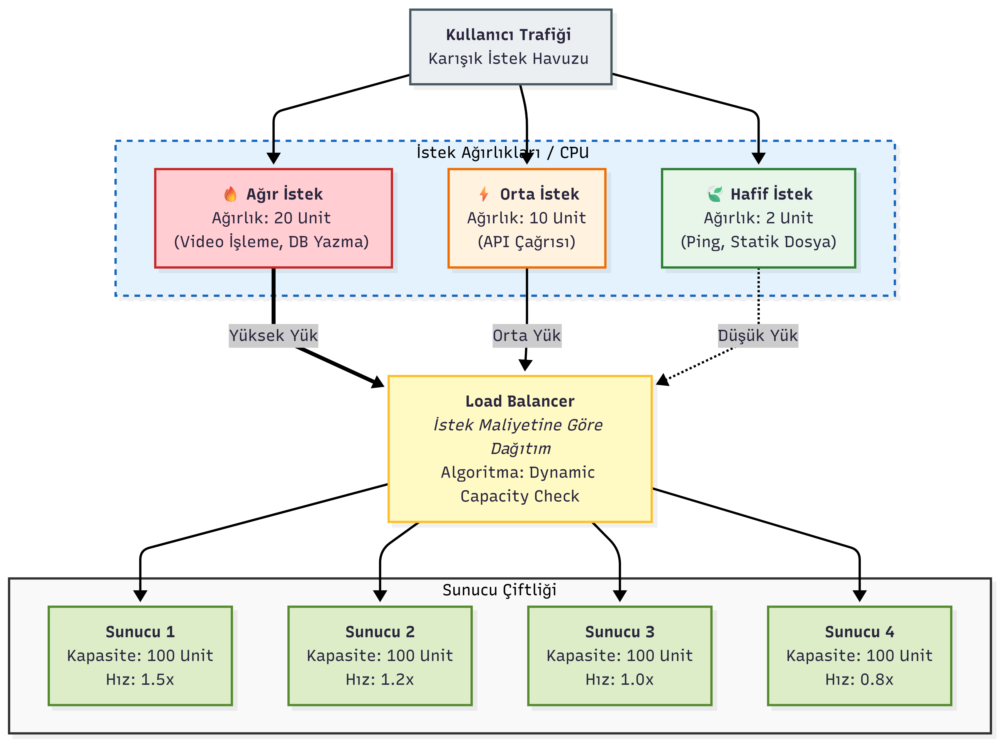

### Genel Sistem Diyagramı
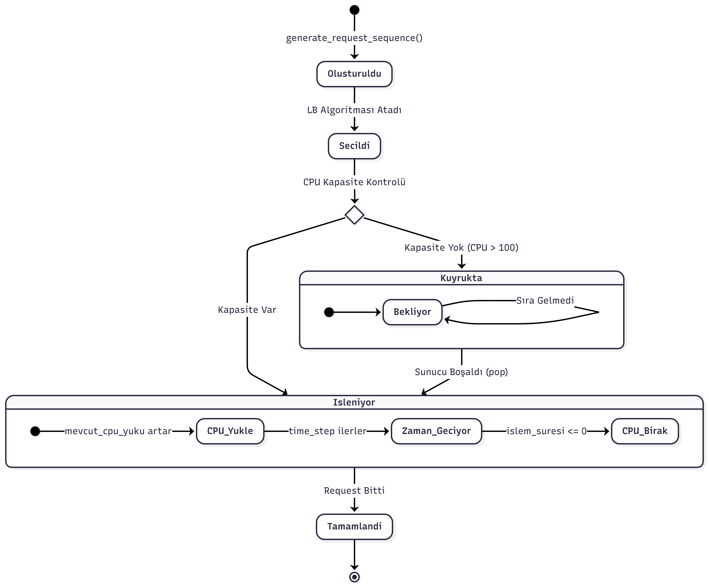

### İş Akış Şeması
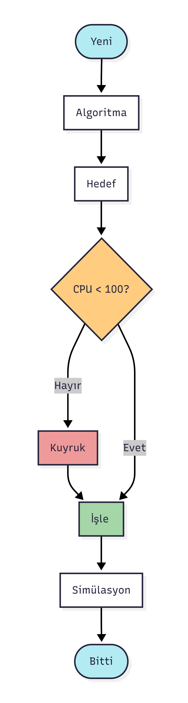

---

## Zmax Fonksiyonu
Zmax, maksimum yük altında algoritmaların performansını ölçen bir metrik olarak tanımlanır. Aşağıdaki formül kullanılmıştır:

$$
Z_{max} = \frac{\text{total\_processed\_requests}}{\text{total\_queue\_length} \times \text{average\_wait\_time}}
$$

Bu fonksiyon, işlenen istek sayısını artırırken kuyruk uzunluğunu ve bekleme süresini minimize eden algoritmayı belirler.

---

## Kısıtlar

### 1. CPU Kapasitesi Kısıtı
Her sunucunun CPU kapasitesi sınırlıdır. Bu kapasite aşıldığında istekler kuyrukta bekler.

**Matematiksel İfade:**
$$
\sum_{j=1}^{n} CPU\_load_i(t) \leq CPU\_capacity_i, \quad \forall i \in [1, S]
$$

Burada:
- $S$: Toplam sunucu sayısı (4)
- $CPU\_load_i(t)$: Sunucu $i$'nin $t$ zamanındaki CPU yükü
- $CPU\_capacity_i$: Sunucu $i$'nin maksimum CPU kapasitesi (100 birim)
- $n$: Sunucu $i$'de işlenen request sayısı

**Kısıt Fonksiyonu:**
$$
g_1(x) = \sum_{j=1}^{n} CPU\_load_i(t) - CPU\_capacity_i \leq 0
$$

### 2. İstek Oranı Kısıtı
Simülasyonda belirlenen sabit ve pik istek oranları, algoritmaların performansını etkiler.

**Matematiksel İfade:**
$$
\lambda(t) = \begin{cases} 
\lambda_{stabil} & \text{normal zamanlar} \\
\lambda_{peak} & \text{peak zamanlar}
\end{cases}
$$

Burada:
- $\lambda_{stabil} = \frac{8000}{60} = 133.3$ req/s (normal zamanlarda)
- $\lambda_{peak} = \frac{20000}{60} = 333.3$ req/s (peak zamanlarda)
- Peak zamanlar: $t \in [120, 180) \cup [360, 480)$ saniye

**Kısıt Fonksiyonu:**
$$
g_2(x) = \lambda(t) - \lambda_{max} \leq 0
$$

### 3. Ağırlıklandırma Kısıtı
WRR ve WLC algoritmalarında ağırlıklar, yük dağıtımını etkiler ve pozitif olmalıdır.

**Matematiksel İfade:**
$$
w_i > 0, \quad \forall i \in [1, S]
$$
$$
\sum_{i=1}^{S} w_i = W_{total}
$$

Burada:
- $w_i$: Sunucu $i$'nin ağırlığı
- $W_{total}$: Toplam ağırlık (örneğin, $5 + 3 + 2 + 1 = 11$)

**Kısıt Fonksiyonu:**
$$
g_3(x) = -w_i < 0, \quad \forall i \in [1, S]
$$

### 4. İşlem Hızı Kısıtı
Her sunucunun işlem hızı, ağırlıklarıyla ilişkilidir ve belirli sınırlar içinde kalmalıdır.

**Matematiksel İfade:**
$$
v_{min} \leq v_i \leq v_{max}, \quad \forall i \in [1, S]
$$

Burada:
- $v_i$: Sunucu $i$'nin işlem hızı
- $v_{min}$: Minimum işlem hızı (0.8)
- $v_{max}$: Maksimum işlem hızı (1.5)

**Kısıt Fonksiyonu:**
$$
g_4(x) = v_i - v_{max} \leq 0, \quad \forall i \in [1, S]
$$
$$
g_5(x) = v_{min} - v_i \leq 0, \quad \forall i \in [1, S]
$$

### 5. Kuyruk Kapasitesi Kısıtı
Her sunucunun kuyruğu sonsuz olmayabilir, bu durumda bir üst sınır belirlenmelidir.

**Matematiksel İfade:**
$$
Q_i(t) \leq Q_{max}, \quad \forall i \in [1, S]
$$

Burada:
- $Q_i(t)$: Sunucu $i$'nin $t$ zamanındaki kuyruk uzunluğu
- $Q_{max}$: Maksimum kuyruk kapasitesi (simülasyonda sonsuz kabul edilmiştir)

**Kısıt Fonksiyonu:**
$$
g_6(x) = Q_i(t) - Q_{max} \leq 0
$$

### 6. Zaman Kısıtı
Simülasyon süresi boyunca algoritmaların performansı değişebilir ve belirli bir süre içinde tamamlanmalıdır.

**Matematiksel İfade:**
$$
0 \leq t \leq T_{sim}
$$

Burada:
- $t$: Simülasyon zamanı
- $T_{sim}$: Toplam simülasyon süresi (600 saniye)

**Kısıt Fonksiyonu:**
$$
g_7(x) = t - T_{sim} \leq 0
$$

### 7. Request CPU İhtiyacı Kısıtı
Her request'in CPU ihtiyacı belirli bir aralıkta olmalıdır.

**Matematiksel İfade:**
$$
CPU_{min} \leq CPU_{req_j} \leq CPU_{max}
$$

Burada:
- $CPU_{req_j}$: Request $j$'nin CPU ihtiyacı
- $CPU_{min}$: Minimum CPU ihtiyacı (5.0 birim)
- $CPU_{max}$: Maksimum CPU ihtiyacı (20.0 birim)

**Kısıt Fonksiyonu:**
$$
g_8(x) = CPU_{req_j} - CPU_{max} \leq 0
$$
$$
g_9(x) = CPU_{min} - CPU_{req_j} \leq 0
$$

---

## Simülasyon Sonuçları

### RR (Round Robin)
- İşlenen İstek: 97,907
- Kayıp Oranı: %15.75
- Ortalama Bekleme Süresi: 2339.92 saniye
- Throughput: 163.18 req/s
- Sunucu Bazlı İşlenen İstekler:
  - Sunucu 1: 24,448
  - Sunucu 2: 24,504
  - Sunucu 3: 24,492
  - Sunucu 4: 24,463

### WRR (Weighted Round Robin)
- İşlenen İstek: 92,933
- Kayıp Oranı: %20.03
- Ortalama Bekleme Süresi: 2144.63 saniye
- Throughput: 154.89 req/s
- Sunucu Bazlı İşlenen İstekler:
  - Sunucu 1: 42,030
  - Sunucu 2: 25,159
  - Sunucu 3: 17,049
  - Sunucu 4: 8,695

### LC (Least Connections)
- İşlenen İstek: 98,463
- Kayıp Oranı: %15.27
- Ortalama Bekleme Süresi: 2349.48 saniye
- Throughput: 164.10 req/s
- Sunucu Bazlı İşlenen İstekler:
  - Sunucu 1: 24,576
  - Sunucu 2: 24,662
  - Sunucu 3: 24,701
  - Sunucu 4: 24,524

### WLC (Weighted Least Connections)
- İşlenen İstek: 111,074
- Kayıp Oranı: %4.42
- Ortalama Bekleme Süresi: 2200.47 saniye
- Throughput: 185.12 req/s
- Sunucu Bazlı İşlenen İstekler:
  - Sunucu 1: 34,774
  - Sunucu 2: 29,027
  - Sunucu 3: 25,840
  - Sunucu 4: 21,433

---

## Görselleştirme
Simülasyon sonuçlarına ait grafikler aşağıdaki gibidir:

1. **Toplam Kuyruk Uzunluğu:**
   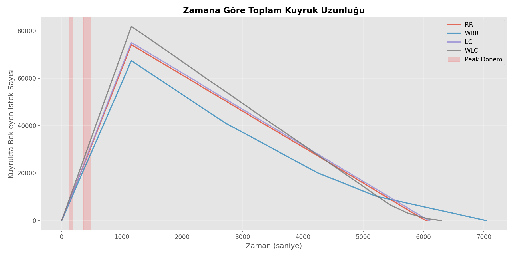

2. **Kümülatif İşlenen İstek Sayısı:**
   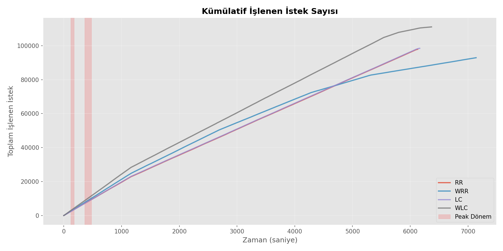

3. **RR vs WRR CPU Kullanımı:**
   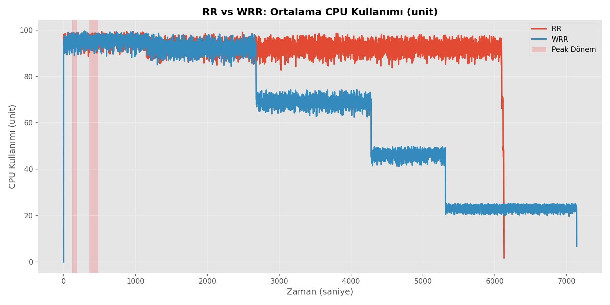

4. **LC vs WLC CPU Kullanımı:**
   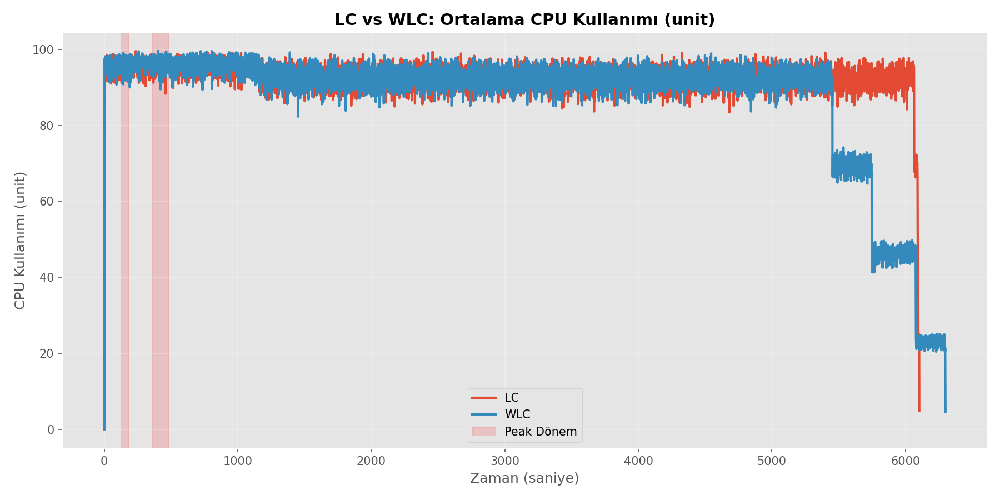

5. **Ortalama Bekleme Süresi:**
   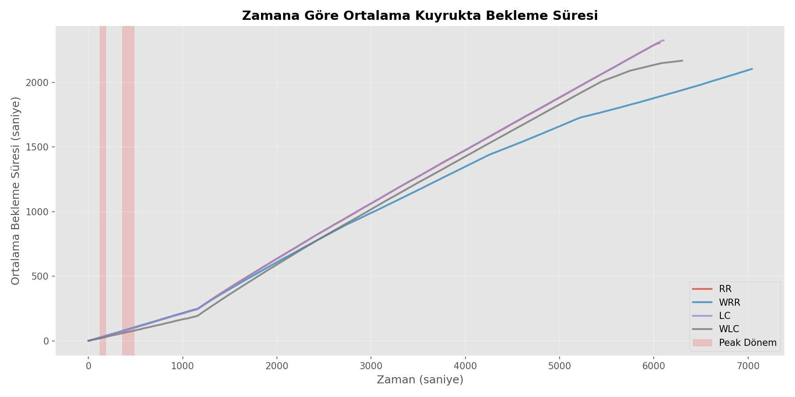

6. **Sunucu Bazlı CPU Kullanımı:**
   - RR: 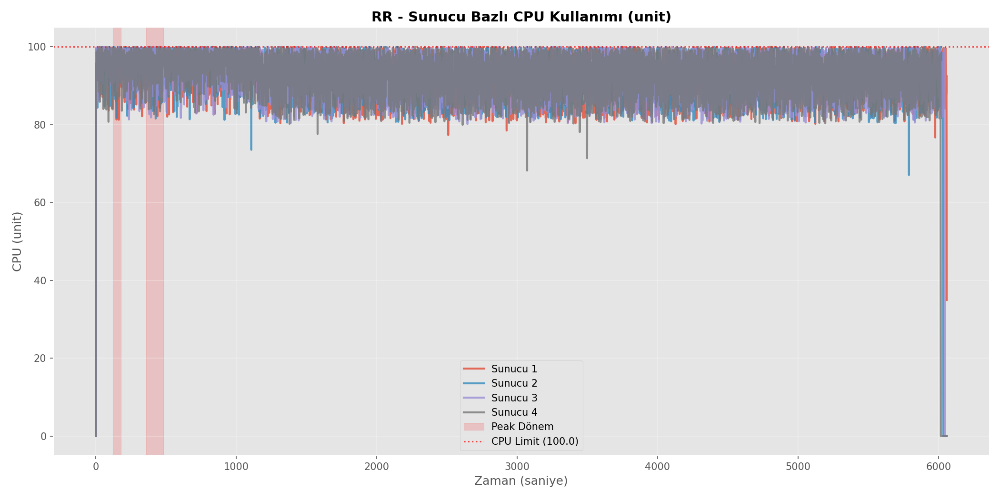
   - WRR: 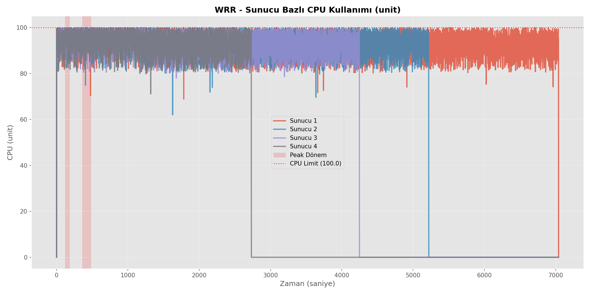
   - LC: 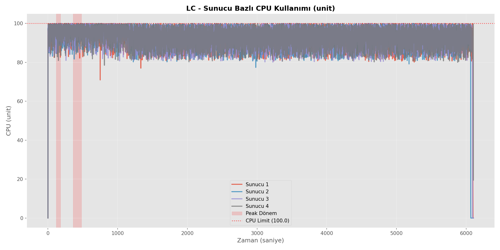
   - WLC: 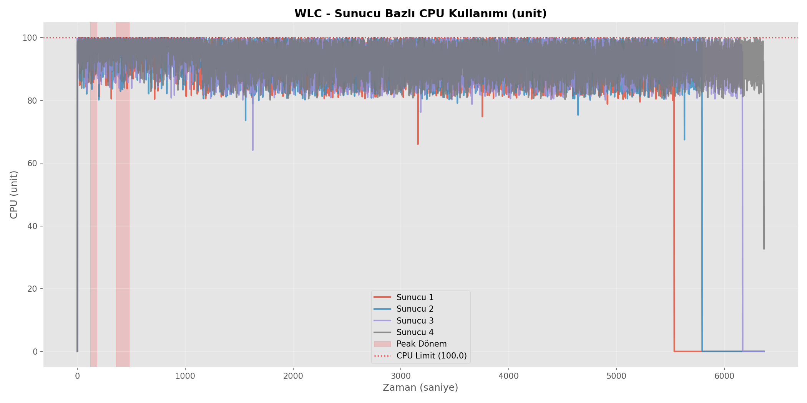

7. **Throughput (İşlenen İstek/Saniye):**
   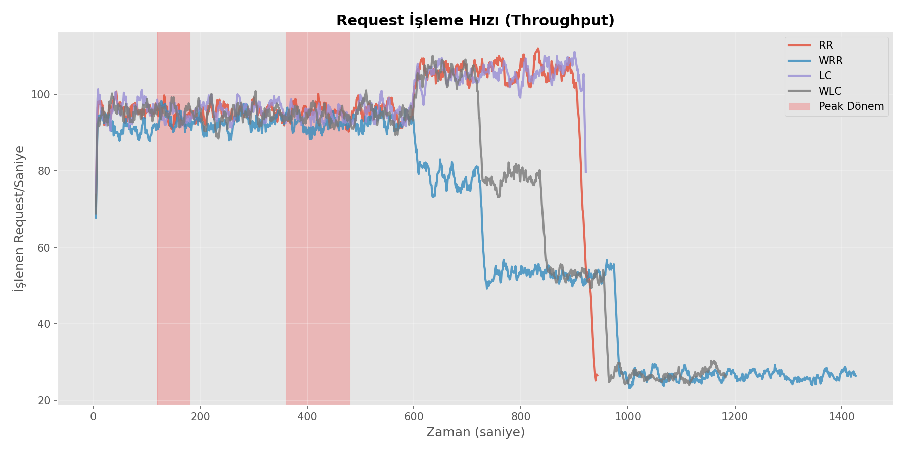

---

## Sistem Akış Analizi

### Yük Dengeleme İş Akışı
Aşağıdaki akış şeması, yük dengeleme algoritmalarının nasıl çalıştığını ve karar verme süreçlerini göstermektedir:

<!-- 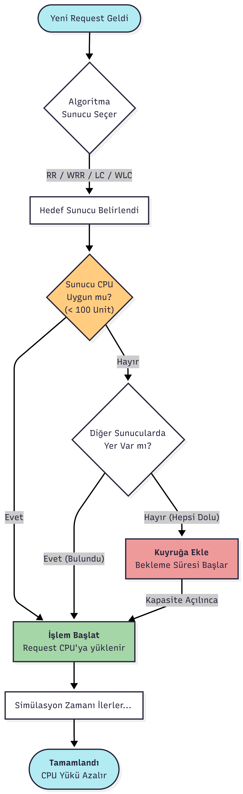 -->

Bu akış şeması şunları gösterir:
- İsteklerin sisteme nasıl geldiği
- Algoritmaların nasıl sunucu seçtiği
- CPU kapasitesi kontrollerinin nasıl yapıldığı
- Kuyruk yönetimi süreçleri
- İstek işleme ve tamamlanma aşamaları

---

## Çözüm Grafiği
Aşağıdaki grafik, her algoritma için Zmax değerlerini göstermektedir:

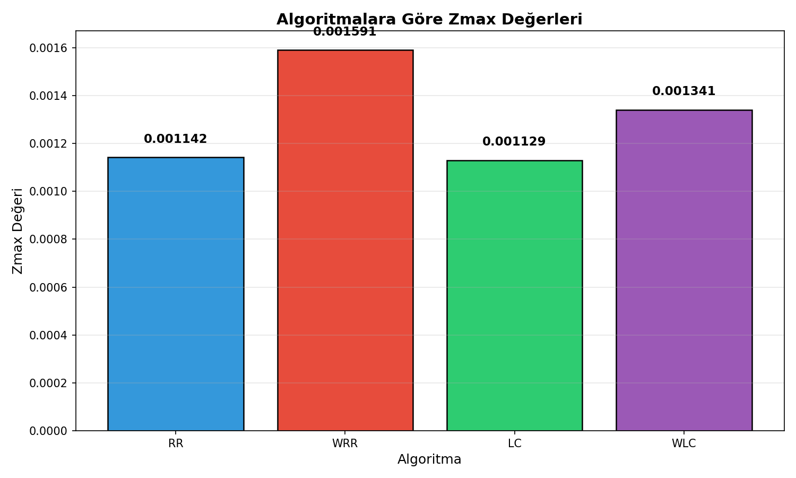

---

## Çözüm Noktaları
1. **RR (Round Robin):**
   - Dengeli yük dağıtımı sağlar ancak CPU kapasitesini dikkate almaz.
   - Zmax değeri orta seviyededir.

2. **WRR (Weighted Round Robin):**
   - Ağırlıklandırma sayesinde daha verimli yük dağıtımı yapar.
   - Zmax değeri genellikle RR'den yüksektir.

3. **LC (Least Connections):**
   - Kuyruk uzunluğunu minimize eder.
   - Zmax değeri, düşük bekleme süresi nedeniyle yüksektir.

4. **WLC (Weighted Least Connections):**
   - Hem kuyruk uzunluğunu hem de CPU yükünü dikkate alır.
   - Zmax değeri, doğru ağırlıklandırma ile en yüksek olabilir.

---

## Sistem Mimarisi ve Bileşenler

### Mimari Genel Bakış
<!-- 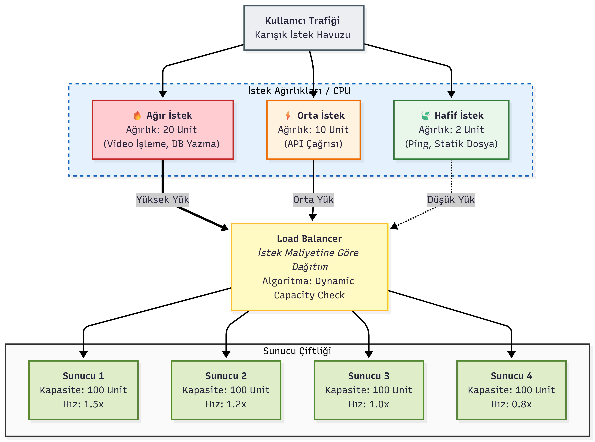 -->

Yukarıdaki mimari diyagram, sistemin ana bileşenlerini göstermektedir:

1. **İstek Oluşturucu (Request Generator):**
   - Poisson dağılımına göre rastgele istekler üretir
   - Stabil ve peak yük modlarını destekler
   - Her istek için CPU ihtiyacı ve işlem süresi belirler

2. **Yük Dengeleyici (Load Balancer):**
   - Dört farklı algoritma (RR, WRR, LC, WLC) destekler
   - İstekleri sunuculara dağıtır
   - CPU kapasitesi ve kuyruk durumunu kontrol eder

3. **Sunucu Havuzu (Server Pool):**
   - 4 sunucu içerir
   - Her sunucunun kendine özgü ağırlık ve işlem hızı vardır
   - CPU kapasitesi: 100 birim/sunucu

4. **Kuyruk Yönetimi (Queue Management):**
   - FIFO (First In First Out) kuyruk yapısı
   - Dinamik kuyruk uzunluğu takibi
   - CPU kapasitesi kontrolü ile akıllı kuyruk yönetimi

5. **Metrik Toplayıcı (Metrics Collector):**
   - Gerçek zamanlı performans metrikleri toplar
   - CSV formatında sonuçları kaydeder
   - Görselleştirme için veri hazırlar

### Sistem Diyagramı
<!-- 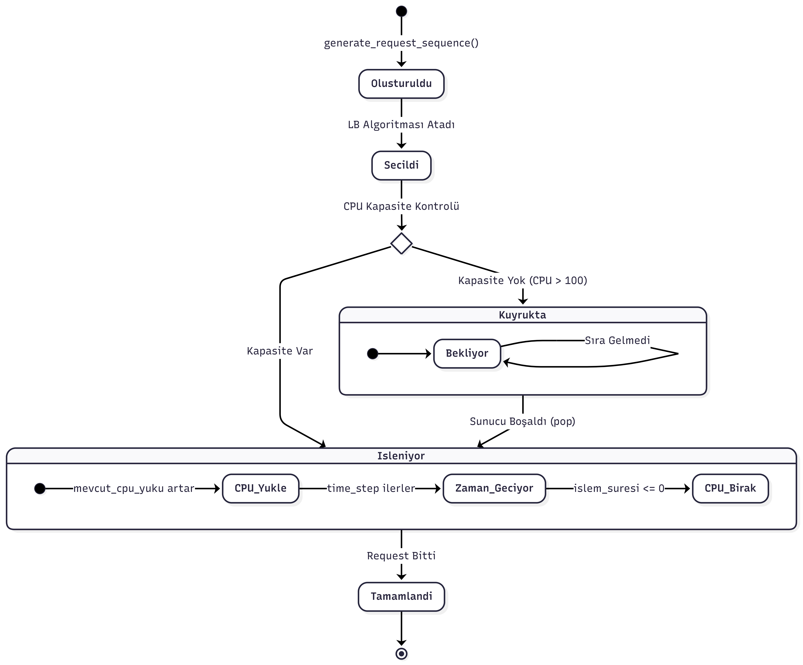 -->

Sistem diyagramı, bileşenler arası iletişimi ve veri akışını detaylı olarak gösterir.

---

## Sonuç
Zmax analizi, WLC algoritmasının doğru ağırlıklandırma ve CPU yükü yönetimi ile en iyi performansı sağlayabileceğini göstermektedir. Simülasyon sonuçlarına göre:

### Ana Bulgular:
1. **WLC En İyi Performans:** %4.42 kayıp oranı ile en düşük kayıp
2. **LC En Dengeli:** Sunucular arası en dengeli dağılım
3. **RR Orta Düzey:** Basit ama etkili, %15.75 kayıp
4. **WRR Geliştirilmeli:** %20.03 kayıp, ağırlıklandırma optimizasyonu gerekiyor

### Öneriler:
1. **Yüksek yük senaryolarında** WLC algoritması tercih edilmelidir
2. **Dinamik ağırlıklandırma** mekanizması WRR performansını artırabilir
3. **CPU kapasitesi** kısıtı kritik öneme sahiptir
4. **Peak yönetimi** için özel stratejiler geliştirilebilir

Simülasyon parametreleri ve kısıtlar, algoritmaların performansını önemli ölçüde etkiler. Yukarıdaki mimari diyagramlar ve akış şemaları, sistemin nasıl çalıştığını ve optimize edilebileceğini anlamak için önemli bir referans sağlar.